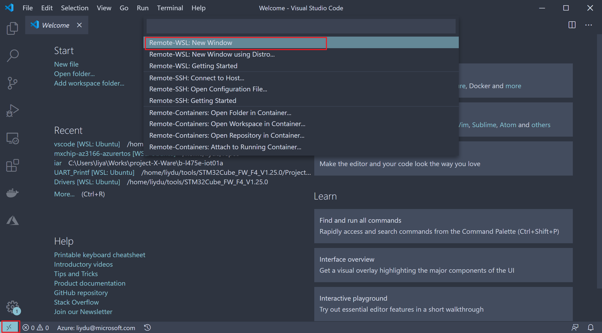

# MXChip AZ3166 IoT DevKit with Azure RTOS

## Prerequistes

* [Ubuntu 18.04 installed in WSL2](https://docs.microsoft.com/windows/wsl/wsl2-install) on Windows 10. You will set up your development environment in it.
* [Visual Studio Code](https://code.visualstudio.com/) for Windows with [Remote - WSL](https://marketplace.visualstudio.com/items?itemName=ms-vscode-remote.remote-wsl) extension installed. This is for code editing and debugging with UI supported. Learn [Develop in WSL](https://code.visualstudio.com/docs/remote/wsl) if you are new to it.
* [STM32Cube MCU Package for STM32F4 series](https://www.st.com/en/embedded-software/stm32cubef4.html). The MXChip AZ3166 IoT DevKit at its core is a STM32F412RG MCU. You will need the STM32 SDK as dependency.
* [OpenOCD for Windows](https://gnutoolchains.com/arm-eabi/openocd/) for flashing and debugging the firmware.
* [Termite](https://www.compuphase.com/software_termite.htm) terminal for viewing log output from COM port.
* [Azure IoT Explorer](https://github.com/Azure/azure-iot-explorer/releases) is a cross platform IoT Hub explorer for retrieving the device connection string and monitoring data communication between device and IoT Hub.

## Preparation

1. Copy the STM32Cube MCU Package for STM32F4 series zip file (e.g. `stm32cube_fw_f4_v1250.zip`) to your WSL2 environment. We recommend copy it to `\\wsl$\Ubuntu-18.04\home\{yourname}\tools\`.

    

1. Launch Ubuntu 18.04 bash command line.

    

1. In Ubuntu, unzip the file. Now you have STM32Cube MCU Package folder in place. The folder name is like **STM32Cube_FW_F4_V1.25.0**.

    ```bash
    unzip ./stm32cube_fw_f4_v1250.zip
    ```

1. Download and untar [GCC ARM Toolchain in Linux](https://developer.arm.com/tools-and-software/open-source-software/developer-tools/gnu-toolchain/gnu-rm/downloads).

    ```bash
    wget -c "https://armkeil.blob.core.windows.net/developer/Files/downloads/gnu-rm/9-2019q4/gcc-arm-none-eabi-9-2019-q4-major-x86_64-linux.tar.bz2"

    untar xvjf ./gcc-arm-none-eabi-9-2019-q4-major-x86_64-linux.tar.bz2 ~/tools/.
    ```

1. Install CMake and Ninja build system.

    ```bash
    sudo apt update && apt install -y cmake ninja-build

    cmake --version
    ```
    Make sure the CMake version is above 3.14.0. If not, you can follow [this guide](https://apt.kitware.com/) to install the latest CMake.

1. Launch Visual Studio Code, click the left bottom corner to launch Remote command palette and select **Remote-WSL: New Window**.

    

1. In Extensions tab (`Ctrl+Shift+X`), search and install the following extensions in the WSL.

    * C/C++
    * CMake
    * CMake Tools
    * Cortex-Debug

    

## Configure Azure IoT Hub

1. Follow [the guide](https://docs.microsoft.com/azure/iot-hub/iot-hub-create-through-portal) to create an Azure IoT Hub.

1. Save the IoT Hub Connection String in **IoT Hub -> Setting -> Shared access policies -> iothubowner -> Connection string** for later use.

1. Launch Azure IoT Explorer, paste the IoT Hub connection string you just
got and select **Connect**.

    

1. Select **New** to create a new IoT device. Enter a device ID for your device
and keep the rest options as default. Then select **Create**.

    

1. Select from the list for the device you just created. In the **Device identity**
tab, copy **Device ID** to Notepad for later use. Then scroll down to find the
**Connection string with SAS token**, select **Primary key** from the
dropdown list then select **Generate** and copy **SAS token connection
string** to Notepad.

    > For the SAS token connection string, please be aware that we only
need the portion of the string starts from **SharedAccessSignature sr=...**.
You can see the below code configuration for the required string format

1. Also copy the **IoT Hub host name** from the highlighted area to the
Notepad.

    

1. You need all these three device credentials for the sample code
to connect to the IoT Hub.
    * IoT Hub host name
    * IoT Hub Device ID
    * IoT Hub Device SAS Token

## Build

We develop and build everything within WSL2.

1. Launch Ubuntu 18.04 bash command line.

1. Clone or download the source code as zip file.

    ```bash
    git clone https://expresslogic.visualstudio.com/X-Ware/_git/project-X-Ware -b MXChip_az3166
    ```

1. Overwrite `startup_stm32f412rx.s` in the STM32 MCU Package folder. This file is modified with ThreadX specific vectors table thus need to overwrite the original one.

    ```bash
    sudo chmod 644 ~/tools/STM32Cube_FW_F4_V1.25.0/Drivers/CMSIS/Device/ST/STM32F4xx/Source/Templates/gcc/startup_stm32f412rx.s

    cd ~/project-X-ware/mxchip-az3166/vscode/

    cp ./misc/startup_stm32f412rx.s ~/tools/STM32Cube_FW_F4_V1.25.0/Drivers/CMSIS/Device/ST/STM32F4xx/Source/Templates/gcc/.

1. If you put the STM32 MCU Package folder in the path other than `~/tools`, you need to modify the `STM32Cube_DIR` in `cmake/FindCMSIS.cmake` that points to your STM32Cube package folder. For STM32F4, it's around line 55.

    ```txt
    ELSEIF(STM32_FAMILY STREQUAL "F4")
    IF(NOT STM32Cube_DIR)
        SET(STM32Cube_DIR "~/tools/STM32Cube_FW_F4_V1.25.0")
    ```

1. Launch VSCode, update the `HOST_NAME`, `DEVICE_ID` and `DEVICE_SAS` you noted in the previous step in `~/project-X-ware/mxchip-az3166/vscode/sample_azure_iot/mqtt_iothub.c`.

    ```c
    //
    // TODO`s: Configure core settings of application for your IoTHub, replace the
    // [IoT Hub Name] and [Device ID] as yours. Use Device Explorer to generate [SAS].
    //

    #ifndef HOST_NAME
    #define HOST_NAME "{Your IoT Hub Name}.azuredevices.net"
    #endif /* HOST_NAME */

    #ifndef DEVICE_ID
    #define DEVICE_ID "{Your Device ID}"
    #endif /* DEVICE_ID */

    #ifndef DEVICE_SAS
    #define DEVICE_SAS "{Your Device SAS Token}"
    #endif /* DEVICE_SAS */

    //
    // END TODO section
    //
    ```

    The following shows example values:

    ```c
    #define HOST_NAME "azurertos.azure-devices.net"

    #define DEVICE_ID "AZURERTOS-DEVICE"

    #define DEVICE_SAS “SharedAccessSignature sr=azurertos.azuredevices.net%2Fdevices%2FAZURERTOS-DEVICE&sig=......%2Fc%3D&se=1587436430”
    ```

1. Build the project with CMake and Ninja. You need to replace the `{Your WiFi SSID}` and `{Your WiFi Password}` with your own WiFi credentials that MXChip IoT DevKit connects to.

  ```bash
  cd ~/project-X-ware/mxchip-az3166/vscode/

  cmake -Bbuild -GNinja -DSTM32_CHIP=STM32F412RG -DCMAKE_BUILD_TYPE=Debug -DWIFI_SSID={Your WiFi SSID} -DWIFI_PASSWORD={Your WiFi Password} -DTOOLCHAIN_PREFIX=~/tools/gcc-arm-none-eabi-9-2019-q4-major

  cmake --build ./build
  ```

1. The compiled binary files are located in the `build` folder.

## Debug

1. Download and unzip [OpenOCD for Windows](https://gnutoolchains.com/arm-eabi/openocd/) to `C:\Program Files(x86)\OpenOCD`. Add `openocd.exe` path in Windows Path Environment Variables.

1. Install ST-Link driver within unzipped OpenOCD folder by running `stlink_winusb_install.bat`.

1. In Windows command line or PowerShell, launch **openocd** server:

    ```cmd
    openocd -c "bindto 0.0.0.0" -s "C:\Program Files(x86)\OpenOCD\share\openocd\scripts" -f interface/stlink.cfg -f target/stm32f4x.cfg
    ```

1. Plugin your MXChip IoT DevKit to your computer.

1. Launch Termite. Make sure you select the right COM port for the DevKit and baud rate is set to **115200**.

1. Launch Ubuntu 18.04 bash command line. Get Windows host IP address:

    ```bash
    cat /etc/resolv.conf
    ```

1. Replace the IP address in `~/project-X-ware/mxchip-az3166/vscode/.vscode/launch.json`.

    ```json
    // Get WSL2 IP from "cat /etc/resolv.conf"
    "gdbTarget": "{Your Windows host IP}:3333",
    ```

1. In VSCode, press `F5` or launch debug Run tab. Then select `sample_azure_iot`.

    

    > If you want to test the `sample_threadx` project, select this one instead.

1. It will first flash the firmware onto the DevKit and start running it and stopped at `main()`. Press `F5` again or select continue to run the app.  

    

1. And you can view in the Termite the DevKit is publising temperature telemetry to IoT Hub in every second.

    

## Clean

* Delete the entire build folder to clean things up.

    ```bash
    rm -rf ./build
    ```