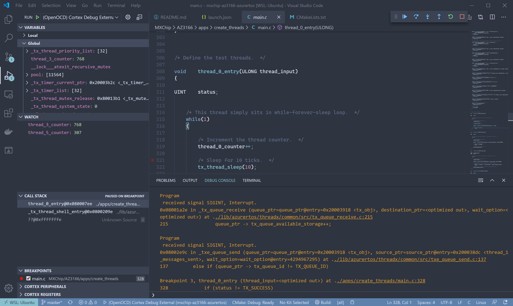

# MXChip AZ3166 IoT DevKit with Azure RTOS

## Prerequiste

* Windows 10 with WSL2 Ubuntu installed.
* Visual Studio Code with these extensions installed within [Remote - WSL](https://marketplace.visualstudio.com/items?itemName=ms-vscode-remote.remote-wsl). Learn [Develop in WSL](https://code.visualstudio.com/docs/remote/wsl) if you are new to it.
    * C/C++
    * CMake
    * CMake Tools
    * Cortex-Debug
* [STM32CubeMx](https://www.st.com/en/development-tools/stm32cubemx.html)
* [OpenOCD for Windows](https://gnutoolchains.com/arm-eabi/openocd/)

## Preparation

* We are using Windows 10 with WSL2 installed.

* In Windows, download and install latest bit of [STM32CubeMx](https://www.st.com/en/development-tools/stm32cubemx.html).

* Get software package for the board from STM32CubeMx. In **Help > Manage embedded software packages**, download and install latest version for STM32F4 series. That is what MXChip IoT DevKit is using (STM32F412RG).

    

* Now open File Explorer, in `C:\Users\\{yourname}\STM32Cube\Repository` you will find downloaded package .zip file named like `stm32cube_fw_f4_v1250.zip`.

* Copy this .zip file to your WSL2 environment. You can do so by copy it to `\\wsl$\Ubuntu-18.04\home\{yourname}\tools\`.

* Unzip the file, now you have STM32Cube package in your WSL2.

* Modify the `STM32Cube_DIR` in `FindCMSIS.cmake` that points to your STM32Cube package. FOr STM32F4, it's around line 55.

* Copy `misc/startup_stm32f412rx.s` to `{where}/STM32Cube_FW_F4_V1.25.0/Drivers/CMSIS/Device/ST/STM32F4xx/Source/Templates/gcc/` and overwrite the original file.

## Build

We develop and build everything within WSL2.

* Launch WSL2 command line.

* Download and untar [ARM GCC in Linux](https://developer.arm.com/tools-and-software/open-source-software/developer-tools/gnu-toolchain/gnu-rm/downloads).

    ```bash
    untar xvjf ./gcc-arm-none-eabi-9-2019-q4-major-x86_64-linux.tar.bz2 ~/tools/.
    ```

* Install Ninja:

    ```bash
    sudo apt update
    ```

    ```bash
    sudo apt install -y ninja-build

* Git clone the repo and all submodules:

    ```bash
    git clone https://github.com/liydu/mxchip-az3166-azurertos.git

    cd mxchip-az3166-azurertos

    git submodule update --init
    ```

* Go to `MXChip/AZ3166` and build:

  ```bash
  cd MXChip/AZ3166

  cmake -Bbuild -GNinja -DSTM32_CHIP=STM32F412RG -DCMAKE_BUILD_TYPE=Debug -DTOOLCHAIN_PREFIX=/home/liydu/tools/gcc-arm-none-eabi-9-2019-q4-major

  cmake --build ./build
  ```

## Debug

* Download and unzip [OpenOCD for Windows](https://gnutoolchains.com/arm-eabi/openocd/). Add `openocd.exe` path in Path Environment Variables.

* Install ST-Link driver within unzipped OpenOCD folder by running `stlink_winusb_install.bat`.

* Within WSL2, get Windows host IP address:

    ```bash
    cat /etc/resolv.conf
    ```

* Replace the IP address in `launch.json`.

* In Windows, launch **openocd**:

    ```cmd
    openocd -c "bindto 0.0.0.0" -s "C:\Program Files(x86)\OpenOCD\share\openocd\scripts" -f interface/stlink.cfg -f target/stm32f4x.cfg
    ```

* `F5` debug in VS Code. Then select `create_threads`.

    